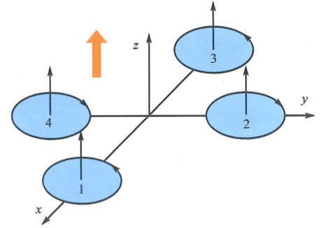
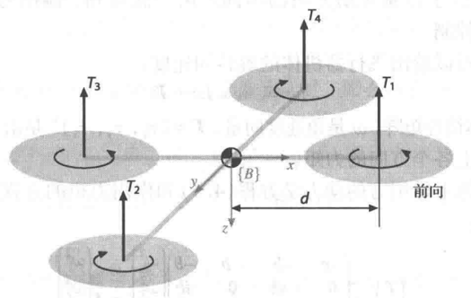
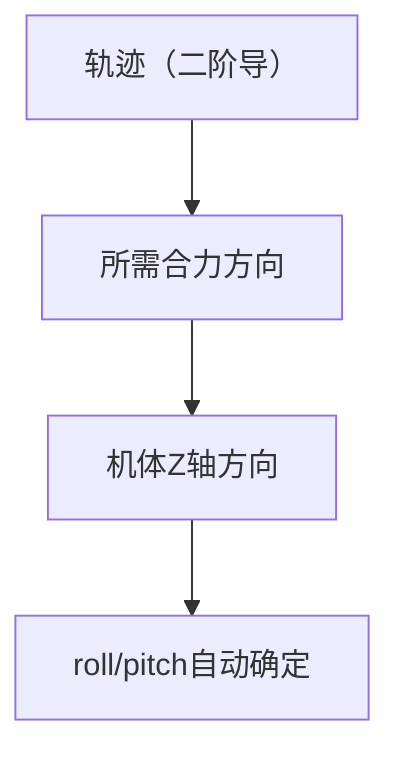
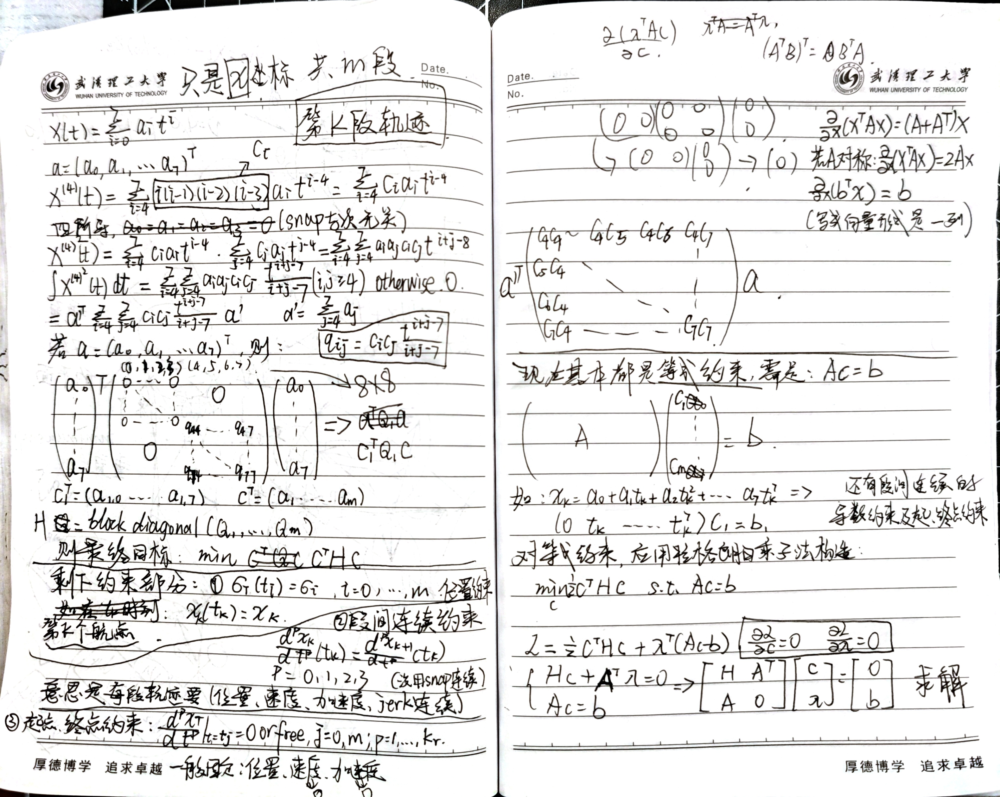

# **This is the study document.**

[TOC]

---

# 1. 四轴旋翼机飞行原理

旋翼运动特点：相对的两个旋翼旋转方向相同，相邻旋翼的旋转方向正好相反，以抵消气流相对运动产生在机体上的反作用力矩。

<p align="center">
   <br>
   <b>图1：四轴示意图</b>
</p>

- 俯仰运动
   - 电机1的转速上升,电机3的转速下降,电机2、4的转速保持不变。由于旋翼1的升力上升,旋翼3的升力下降,产生的不平衡力矩使机身绕y轴旋转,直升机则向后仰。

- 滚转运动
   - 在所示图中,改变电机2和电机4的转速,保持电机1、3的转速不变,则可使直升机绕x轴旋转,并实现向左或向右的转动,实现直升机的滚转运动。
   
- 偏航运动
   - 旋翼转动过程中由于空气阻力的作用会形成与转动方向相反的反扭力矩,当四个电机转速相同时，四个旋翼产生的反扭力矩相互平衡，四旋翼直升机不发生转动（无陀螺效应）。当四个电机转速不完全相同时,不平衡的反扭力矩会引起四旋翼直升机的转动。例如：当电机1、3的转速上升,而电机2和电机4的转速下降时,旋翼1和3对机身的反扭力矩大于旋翼2和4对机身的反扭力矩。此时,机身便沿着与电机1、3的转向相反的方向绕z轴转动,实现直升机的偏航运动。
   
- 前后、左右运动
   - 要想实现直升机在水平面内前后、左右的运动,必须在水平面内对直升机施加一定的力。增加电机3的转速,使升力增大,相应减小电机1的转速,使升力减小,同时保持其他两个电机转速不变,并使反扭力矩仍然保持平衡,此时,直升机就会朝前产生一定程度的倾斜,从而使旋翼升力产生一个水平向前的分量,实现直升机的前飞运动。向后的飞行与向前的飞行操纵过程正好相反。同理,保持电机1和3转速不变,控制电机2和4的转速即可实现直升机的左右侧向运动。

---

# 2. 飞行力学

<p align="center">
   <br>
   <b>图2：推力矢量示意图</b>
</p>

四旋翼飞行器示意图,包括4个旋翼及其推力矢量和旋转方向。机体坐标系固联在飞行器上，其原点与飞行器质心重合。旋翼1和旋翼3逆时针旋转(从上往下看),旋翼2和旋翼4顺时针旋转。

---

## 2.1 受力分析

设旋翼转速为 $\boldsymbol{\omega}_{i}$，产生一个向上的推力向量,指向z轴的负方向:

$$
\mathbf{T}_{i} = b\boldsymbol{\omega}^2_{i}, \ i = 1, 2, 3, 4 \tag{1}
$$

- 其中 $b>0$ 为升力常数，取决于空气密度、旋翼叶片半径的立方、叶片的数量以及叶片的弦长
- $T = \sum_{i=1}^{n} b\boldsymbol{\omega}^2_{i}$

由牛顿第二定律,可以给出该飞行器在世界坐标系中的移动动力学方程:

$$
m\dot{\mathbf{v}} = \begin{pmatrix} 0 \\ 0 \\ m\mathbf{g} \end{pmatrix} - {}^{0}\mathbf{R}_{B}\begin{pmatrix} 0 \\ 0 \\ \mathbf{T} \end{pmatrix} \tag{2}
$$

- 其中, $\mathbf{v}$ 是飞行器在世界坐标系中的速度，$\mathbf{g}$ 是重力加速度, $m$ 是该飞行器的总质量，$\mathbf{T}$ 是总的向上推力

每对旋翼之间的推力差异就会导致飞行器旋转。例如在$x$轴上产生的转矩即为横滚力矩，由2和4两个旋翼的推力差产生,其大小为:

$$
\boldsymbol{\tau}_{x} = d\mathbf{T}_{4} - d\mathbf{T}_{2} \tag{3}
$$

- 其中, $d$ 是电机到飞行器质心的距离

结合前述旋翼升力表达式，可得到该力矩关于翼旋转速表达式：

$$
\boldsymbol{\tau}_{x} = db(\boldsymbol{\omega}^2_{4} - \boldsymbol{\omega}^2_{2}) \tag{4}
$$

类似地,在 $y$ 轴上产生的转矩即俯仰力矩,其大小是：

$$
\boldsymbol{\tau}_{y} = db(\boldsymbol{\omega}^2_{1} - \boldsymbol{\omega}^2_{3}) \tag{5}
$$

除去升力外，还有阻力。电机施加到每个旋翼桨上的转矩与空气阻力力矩方向相反，可表示为：

$$
\mathbf{Q}_{i} = k\boldsymbol{\omega}^2_{i} \tag{6}
$$

- 其中，$k$ 与升力常数 $b$ 的影响因素相同

该转矩会对飞行器机体施加一个反转力矩，其作用是使整个机体产生一个绕旋翼轴的转动，但方向与旋翼转向相反。因此，在z轴上总的转矩是：

$$
\boldsymbol{\tau}_{z} = \mathbf{Q}_{1} - \mathbf{Q}_{2} + \mathbf{Q}_{3} - \mathbf{Q}_{4} = k(\boldsymbol{\omega}^2_{1} -\boldsymbol{\omega}^2_{2} +\boldsymbol{\omega}^2_{3} -\boldsymbol{\omega}^2_{4}) \tag{7}
$$

- 其中，不同的正负号对应于旋翼转动方向的不同

由上式可知，偏摆力矩可以简单地通过调整4个旋翼的转速来控制。

---

## 2.2 动力学模型分析

由欧拉运动方程可以给出飞行器机体的旋转加速度:

$$
\mathbf{I}\dot{\boldsymbol{\omega}} = -\boldsymbol{\omega} \times \mathbf{I}\boldsymbol{\omega} + \boldsymbol{\Gamma} \tag{8}
$$

- 其中, $\mathbf{I}$ 是 $3 \times 3$ 的机体惯性矩阵, $\boldsymbol{\omega}$ 是角速度向量（表达在机体坐标系中），$\boldsymbol{\Gamma} = {(\boldsymbol{\tau}_{x}, \boldsymbol{\tau}_{y}, \boldsymbol{\tau}_{z})}^\top$ 是前述作用在机体上各个方向的力矩
- 若假设无人机中心对称，则 $\mathbf{I}$ 则为惯量主轴，其对角线均为转动惯量，表达如下：

$$
\mathbf{I} = \begin{pmatrix} I_{xx} & 0 & 0 \\ 0 & I_{yy} & 0 \\ 0 & 0 & I_{zz} \end{pmatrix}
$$

通过整合计算机体上作用力的动力学方程和作用力矩的方程，可以得到四旋翼飞行器的运动模型:

$$
\begin{pmatrix} \mathbf{T} \\ \boldsymbol{\Gamma} \end{pmatrix} = \begin{pmatrix} -b & -b & -b & -b \\ 0 & -db & 0 & db \\ db & 0 & -db & 0 \\ k & -k & k & -k \end{pmatrix}\begin{pmatrix} \boldsymbol{\omega}^2_{1} \\ \boldsymbol{\omega}^2_{2} \\ \boldsymbol{\omega}^2_{3} \\ \boldsymbol{\omega}^2_{4} \end{pmatrix} = \mathbf{A}\begin{pmatrix} \boldsymbol{\omega}^2_{1} \\ \boldsymbol{\omega}^2_{2} \\ \boldsymbol{\omega}^2_{3} \\ \boldsymbol{\omega}^2_{4} \end{pmatrix} \tag{9}
$$

对上述模型求逆，可得到：

$$
\begin{pmatrix} \boldsymbol{\omega}^2_{1} \\ \boldsymbol{\omega}^2_{2} \\ \boldsymbol{\omega}^2_{3} \\ \boldsymbol{\omega}^2_{4} \end{pmatrix} = \mathbf{A}^{-1}\begin{pmatrix} \mathbf{T} \\ \boldsymbol{\tau}_{x} \\ \boldsymbol{\tau}_{y} \\ \boldsymbol{\tau}_{z} \end{pmatrix} \tag{10}
$$

利用上式可以求出为给机体施加特定的力和力矩所需要的各旋翼转速。

## 2.4 补充姿态运动学
姿态运动学公式：
$$
\dot{q} = \frac{1}{2}\boldsymbol{\Omega}(\boldsymbol{\omega})q
$$
- 其中，$q = (q_w, q_x, q_y, q_z)^\top = (w, x, y, z)^\top$，$\boldsymbol{\omega} = (p, q, r)^\top$是机体角速度系

矩阵 $\boldsymbol{\Omega}(\boldsymbol{\omega})$是：
$$
\boldsymbol{\Omega}(\boldsymbol{\omega}) = \begin{pmatrix} 0 & -p & -q & -r \\ p & 0 & r & -q \\ q & -r & 0 & p \\ r & q & -p & 0 \end{pmatrix}
$$

前文中的 ${}^{0}\mathbf{R}_{B}$ 实际就是机体到世界坐标系的旋转变换矩阵，通过姿态四元数，可以定义如下：
$$
{}^{0}\mathbf{R}_{B} = \mathbf{R}(q) = \begin{pmatrix} 1 - 2(y^2 + z^2) & 2(xy - wz) & 2(xz + wy) \\ 2(xy + wz) & 1 - 2(x^2 + z^2) & 2(yz - wx) \\ 2(xz - wy) & 2(yz + wx) & 1 - 2(x^2 + y^2) \end{pmatrix}
$$

---

# 圆形轨迹飞行

- 初始想法是在机体坐标系中给 $y$ 轴速度，给 $x$ 轴加速度，但是使用vehicle_local_position_setpoint失败，查看话题其实没有这个，这个貌似是回传监测之类的，无法通过这个直接对机体物理量进行控制
- 还有一种想法是对原型轨迹坐标点进行采样，直接使用trajectory_setpoint进行控制，但是这种总感觉有问题，不是某种意义上的原型轨迹
- 现在的想法是通过坐标变换，将机体坐标系中的物理量变换到世界坐标系，通过trajectory_setpoint就能直接进行控制

最终还是完成了，坐标变换的方法还是没有成功，最后还是使用了路径点生成的方法实现了圆形轨迹 :
$$
x = Rcos\theta \\
y = Rsin\theta
$$
- 订阅vehicle_global_position获得海拔，大于某个值开始原型轨迹飞行
- 使用trajectory_setpoint执行position控制，每100ms更新一次目标位置
- $\theta = \omega{t}$，$\Delta{t} = 100ms$
  
---

# 四元数学习

## 四元数 = 旋转的数学表达方式之一，比欧拉角更稳定，比矩阵更省内存。
$$
q = (\omega, x, y, z)
$$
满足：
$$
\omega^2 + x^2 + y^2 + z^2 = 1
$$
- 单位四元数，代表一个旋转
---
## 四元数本质：
$$
q = (cos\frac{\theta}{2}, sin\frac{\theta}{2}\cdot\hat{u})
$$
- 其中，$\hat{u} = (u_x, u_y, u_z)^\top$ 是旋转轴，$\theta$ 是旋转角
---
## 几何意义：
$$
q = (\omega, x, y, z)
$$
- 绕轴：$(x, y, z)^\top$
- 旋转角： $\theta = 2arccos(\omega)$
- 将旋转组合成轴和角度表达
---
## 四元数旋转：
对一个三维向量 $v$ 进行旋转，用四元数形式：
$$
v' = q\cdot{v}\cdot{q^{-1}}
$$
- $q$ 为四元数
- $q^{-1}$ 为逆，对于单位四元数，逆就是共轭
- $v = (0, v_x, v_y, v_z)$
---
## 四元数与欧拉角、旋转矩阵转换
欧拉角到四元数：
```cpp
q.w = cos(yaw/2)*cos(pitch/2)*cos(roll/2) + sin(yaw/2)*sin(pitch/2)*sin(roll/2);
q.x = cos(yaw/2)*cos(pitch/2)*sin(roll/2) - sin(yaw/2)*sin(pitch/2)*cos(roll/2);
q.y = cos(yaw/2)*sin(pitch/2)*cos(roll/2) + sin(yaw/2)*cos(pitch/2)*sin(roll/2);
q.z = sin(yaw/2)*cos(pitch/2)*cos(roll/2) - cos(yaw/2)*sin(pitch/2)*sin(roll/2);
```
四元数到欧拉角：
```cpp
roll  = atan2(2*(w*x + y*z), 1 - 2*(x*x + y*y));
pitch = asin(2*(w*y - z*x));
yaw   = atan2(2*(w*z + x*y), 1 - 2*(y*y + z*z));
```
四元数到旋转矩阵：
```cpp
R = [
1 - 2(y² + z²)   2(xy - wz)      2(xz + wy)
2(xy + wz)       1 - 2(x² + z²)  2(yz - wx)
2(xz - wy)       2(yz + wx)      1 - 2(x² + y²)
]
```
---
## 复合旋转与四元数乘法
假设 $q1$ 和 $q2$ 是两个旋转，
$$
q = q2 \cdot q1
$$
- 代表，先做 $q1$ 的旋转，再做 $q2$ 的旋转

四元数乘法：
```cpp
q.w = q2.w*q1.w - q2.x*q1.x - q2.y*q1.y - q2.z*q1.z;
q.x = q2.w*q1.x + q2.x*q1.w + q2.y*q1.z - q2.z*q1.y;
q.y = q2.w*q1.y - q2.x*q1.z + q2.y*q1.w + q2.z*q1.x;
q.z = q2.w*q1.z + q2.x*q1.y - q2.y*q1.x + q2.z*q1.w;
```
## 注意
- 四元数必须归一化
```cpp
q = q / norm(q);
```
- 欧拉角转换注意顺序，PX4 的默认顺序是 ZYX (yaw → pitch → roll)

---

# 3. Minimum Snap

minisnap 轨迹是通过最小化位置的四阶导数（snap）平方积分得到的最平滑轨迹，能显著降低无人机姿态变化带来的抖动和能耗，是目前无人机高速飞行与精准控制中最常用的轨迹规划方法之一。

- jerk：推力变化快慢
- snap：电机输入变化的“剧烈程度”

---

## 3.1 Differential Flatness
### 3.1.1 选对 4 个输出变量，就可以“反推出”无人机的所有状态和控制输入：
$$
\boldsymbol{\sigma} = [x, y, z, \psi]^\top
$$
- 位置：$x, y, z$
- 偏航角yaw：$\psi$

只要这四个是光滑函数，其他都能算出来

---

### 3.1.2 无人机“想要产生某个加速度”，它只能通过“把自己倾斜”，让推力方向指向那个加速度方向：
$$
\mathbf{z}_{B} = \frac{\ddot{\mathbf{r}} + \mathbf{gz}_{W}}{\|\ddot{\mathbf{r}} + \mathbf{gz}_{W}\|}
$$
- 机体 z 轴 = 合加速度方向
- **只要轨迹二次可导，那么姿态就自动存在**


---

### 3.1.3 关于roll/pitch的确定
- 若是单位向量，则自带一个约束：长度为1，则只剩下两个自由度
- 那么，只剩下一个自由度，那就是绕$z_{B}$的旋转，也就是yaw，其余$y_{B}, x_{B}$必在与之垂直的平面内，所以加入一个$\psi$就能确定最后一个自由度，那么无人机的roll/pitch就已经完成了自动匹配

**注意：**
这里我们需要一个在水平面上的参考方向$x_{C}$,这个方向是我们自己给定的，就是所说的yaw：
$$
x_{C} = [cos\psi, sin\psi, 0]^\top
$$
有了这个之后，就能直接确定无人机的姿态，这里重要的是，有了$z_{B}$和$x_{C}$，才能开始确定无人机的姿态，是靠这两个来的：
**如何在“$z_{B}$垂直的平面里”，选一个“尽量对齐$x_{C}$的机头方向”？**
- 首先，先确定$y_{B}$的方向，构造了一个垂直于$z_{B}$的向量：
$$
y_{B} = \frac{z_{B} \times x_{C}}{\|z_{B} \times x_{C}\|}
$$
- 接着，通过右手定则直接构造出了第三个向量：
$$
x_{B} = y_{B} \times z_{B} \tag{1}
$$
- **这里的$x_{B}$其实已经是把$x_{C}$投影到了垂直于$z_{B}$的平面**，通过带入$y_{B}$到（1）里，就能获得完整的投影公式，这里是为了直接获得正交坐标系来确定无人机的姿态，其实结果就是这个：
$$
x_{B} = x_{C} - (x_{C}\cdot{z_{B}})z_{B}
$$
- 先做$y_{B}$就是为了让投影满足右手正交系，这样就直接固定了无人机的姿态

---

### 3.1.4 角速度与角加速度
根据论文的原理，角速度和角加速度也是$\sigma$（平坦输出：flat outputs）以及其导数的函数，这样就能反推出$\mathbf{T},\boldsymbol{\Gamma}$，从而再反推出每个电机的转速$\boldsymbol{\omega}^2_{i}$实现控制

---

## 3.2 最小Snap
最小 snap = 最小“姿态和角速度的抖动”
- snap->jerk->p,q->姿态变化
- snap小->控制输入平滑->飞得稳
- 滚转/俯仰控制力矩$u_{2},u_{3}$直接依赖于位置的4阶导数（Snap）
- 偏航控制力矩$u_{4}$直接依赖于偏航角的2阶导数

### 3.2.1 约束条件建议
推荐边界条件：
起点：
- 位置: 指定（必须）
- 速度: 0（推荐）
- 加速度: 0（推荐）
- Jerk: 自由
- Snap: 自由

终点：
- 位置: 指定（必须）
- 速度: 0（推荐，除非想飞过终点）
- 加速度: 0（推荐）
- Jerk: 自由
- Snap: 自由

连续性条件：
- C³连续：位置、速度、加速度、jerk连续
- Snap可以不连续

---
 ### 3.2.2 Minimum Snap原理
- 在平坦输出空间，将轨迹表达成分段多项式的形式，用QP求解多项式系数，每段轨迹有一定时间
- 轨迹的表达形式：
$$
\sigma_{T}(t) = 
\begin{cases}
\sum_{i=0}^{n} \sigma_{Ti1}t^{i}, & t_{0} \le t < t_{1} \\
\sum_{i=0}^{n} \sigma_{Ti2}t^{i}, & t_{1} \le t < t_{2} \\
\qquad \vdots \\
\sum_{i=0}^{n} \sigma_{Tim}t^{i}, & t_{m-1} \le t < t_{m}
\end{cases}
$$
- m段，每段是个n阶多项式，同时$\sigma = [x, y, z, \psi]^\top$，每个$x, y, z, \psi$都要独立计算
- 如在$x$方向上：
$$
x_{k}(t) = a_{k,0} + a_{k,1}t + a_{k,2}t^{2} + \dots + a_{k,n}t^{n}
$$
- 定义这一段$\mathbf{a}_{k} = [a_{k,0}, a_{k,1}, \dots, a_{k,n}]^\top$，那么将所有的m段轨迹的系数拼起来，就是：
$$
\mathbf{c} = \begin{bmatrix} \mathbf{a_1} \\ \mathbf{a_2} \\ \vdots \\ \mathbf{a_m}\end{bmatrix}
$$
- 目标优化函数如下：
$$
min\int_{t_0}^{t_{m}} \mu_{r}\|\frac{d^{k_{r}}r_{T}}{dt^{k_{r}}}\|^2  + \mu_{\psi}(\frac{d^{k_{\psi}}\psi_{T}}{dt^{k_{\psi}}})^2 dt
$$
- **选择$k_{r} = 4, k_{\psi} = 2$，因为对$u_2, u_3$来说，是以位置的四阶导数的函数出现的，而$u_4$是以yaw的二阶导数的形式出现的，所以选择$k_r = 4, k_\psi = 2$**
- 下面的推导过程在纸上进行：
<p align="center">
   <br>
   <b>图：推导最优轨迹系数示意图</b>
</p>

- 完成求解，就能获得系数，得到$x$方向的最优轨迹，其余两个方向及yaw同理

---